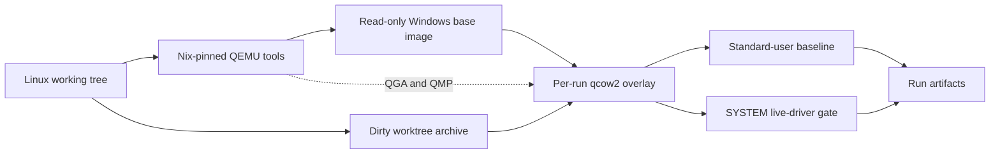

# Plan: contained Windows build and end-to-end tests

## Goal

Add a reproducible Windows amd64 test appliance for Linux developers. The
appliance must build and test the current working tree in a disposable QEMU/KVM
virtual machine. It must also run opt-in tests against the pinned, signed
Mullvad split-tunnel driver.

The virtual machine is the containment boundary. Run QEMU directly on the Linux
host. Do not add a Docker or Podman runner around QEMU. The current controller
tests do not need a container network, a host bridge, or a privileged OCI
container.

Keep the existing portable gate fast and independent of Windows:

```console
just check
```

Add explicit commands for the costly or stateful Windows gates. Ordinary
`go test ./...` must not install, start, initialize, reset, or remove a live
driver.

## Source findings

This plan is based on the old local harness brief, the current repository, and
the working `../tor-driver/dev/winvm` implementation.

### Current repository

- The module requires Go 1.25.0 or later. CI currently uses Go 1.25.5.
- The library supports Windows amd64 and arm64. Start the local VM gate with
  amd64 because the expected Linux development host can use x86-64 KVM.
- The project has no cgo code. Windows builds use `CGO_ENABLED=0` and do not
  need MinGW, LLVM, Visual Studio, or the WDK.
- `platform_windows_test.go` contains native Windows tests that need neither
  elevation nor the driver.
- Existing unit tests cover the controller and protocol through a fake
  transport. They do not open the device.
- `flake.nix` already pins signed driver 1.3.0.0 packages for amd64 and arm64.
  The amd64 package is the live-test input. Do not fetch a second driver from
  another URL.
- The controller does not install the driver or own WFP sublayers, a TUN,
  routes, or DNS settings. A tagged test fixture can own temporary WFP objects,
  but this code must not become part of the public package.
- The driver device is global and exclusive. Run live-driver tests serially in
  one guest.
- [`VALIDATION.md`](../VALIDATION.md) and the C2 milestone in
  [`mullvad-controller-plan.md`](mullvad-controller-plan.md) define the missing
  live-driver evidence.

### Reusable `tor-driver` design

Reuse these proven parts of the sibling harness:

- direct QEMU/KVM with q35 and OVMF;
- an unattended Windows Server 2022 Evaluation Server Core installation;
- a content-addressed, read-only qcow2 base image;
- one qcow2 overlay and one OVMF variable-store copy per run;
- QMP and QEMU Guest Agent sockets with short, unique paths;
- QEMU user-mode networking with an SSH port bound to loopback;
- a standard `winvm` account for ordinary builds and tests;
- QEMU Guest Agent execution as `SYSTEM` for the elevated gate;
- key-only SSH with a recorded host key;
- packaging tracked, modified, and eligible untracked files;
- bounded boot, test, shutdown, and process-cleanup timeouts;
- structured run metadata and retained failure artifacts;
- host-only tests for hashes, packaging, QGA/QMP, locking, overlays, and safe
  cleanup.

Port this design and rename it for this repository. Do not make this project
depend on the sibling checkout at run time.

### Parts to remove from the old brief

Do not implement these items in the first harness:

- an OCI runner, Docker, Podman, or engine-selection support;
- libvirt, Packer, a persistent host bridge, TAP devices, or network namespaces;
- `NET_ADMIN`, `/dev/net/tun`, nftables, or packet capture;
- Wintun, route control, or DNS policy in the controller package;
- cgo, MinGW, Visual Studio, the WDK, or driver compilation;
- test certificates, test-signing mode, or disabled code integrity;
- TPM, Secure Boot, HVCI, or a Windows arm64 VM in the first milestone;
- a requirement that `just test` or `just check` boot Windows.

These features solve a different problem. Add one later only when a specific
test requires it.

## Test layers

Keep four distinct gates:

| Gate                 | Proposed command              | Evidence                                                                    |
| -------------------- | ----------------------------- | --------------------------------------------------------------------------- |
| Cross-build          | `just build-windows`          | All packages compile for Windows amd64 and arm64. No Windows code runs.     |
| Hosted Windows       | Existing GitHub `windows` job | Native unit, vet, and build checks run without a live driver.               |
| Local VM baseline    | `just test-windows-vm`        | The dirty working tree builds and ordinary tests run on Windows amd64.      |
| Local VM live driver | `just test-windows-e2e`       | Tagged, elevated tests control the pinned signed driver in a fresh overlay. |

The local baseline and live-driver gates can use the same base image and run
orchestrator. They must remain separate commands. This separation prevents a
normal native Windows test from changing a driver by accident.

## Architecture



Use SSH for source transfer, ordinary commands, and an interactive diagnostic
shell. Use QGA as the authoritative control channel for elevated tests,
shutdown, and recovery. A driver or WFP test must not depend on its own network
connection for cleanup.

## Proposed repository layout

Add these tracked files:

```text
dev/winvm/
  README.md
  config.json
  image-lock.json
  env.example
  Autounattend.xml
  provision.ps1
  test.ps1
  driver.ps1
  e2e.ps1
  common.sh
  doctor.sh
  build-image.sh
  run.sh
  package-worktree.sh
  tools/qga.py
  tests/host-scripts.sh

integration/
  driver_windows_test.go
  wfp_windows.go
```

The exact test package name can change during implementation. Keep all live test
files behind both of these constraints:

```go
//go:build windows && winintegration
```

Use these untracked locations:

```text
${XDG_CACHE_HOME:-$HOME/.cache}/mullvad-split-tunnel-go/winvm/
.artifacts/winvm/run-<id>/
dev/winvm/env
```

Add narrow `.gitignore` rules for the local environment file, run artifacts, VM
disks, generated ISO files, sockets, and Python bytecode. Do not ignore the
configuration, lock files, source fixtures, or PowerShell scripts.

## Stable commands

Extend the existing `justfile` with these recipes:

| Command                   | Purpose                                                                                                                 |
| ------------------------- | ----------------------------------------------------------------------------------------------------------------------- |
| `just winvm-doctor`       | Validate Linux host tools, KVM access, input paths, hashes, memory, disk space, and port allocation. Do not start a VM. |
| `just winvm-input-hashes` | Print local Windows and VirtIO ISO hashes for a reviewed lock update.                                                   |
| `just winvm-image`        | Build or reuse the content-addressed base image.                                                                        |
| `just test-windows-vm`    | Run the native Windows baseline in a new overlay.                                                                       |
| `just test-windows-e2e`   | Run only the tagged live-driver tests as `SYSTEM` in a new overlay.                                                     |
| `just winvm-shell RUN`    | Open a retained failed overlay through verified SSH.                                                                    |
| `just winvm-clean`        | Remove validated run directories and overlays, but keep the base image.                                                 |

Do not add either VM test to `just test` or `just check`. Preserve the current
meaning of those commands. The repository guidelines require native driver tests
to stay opt-in.

## Inputs and locking

### Developer-supplied inputs

The developer supplies only licensed installation media:

```dotenv
WINVM_WINDOWS_ISO=/absolute/path/to/windows-server-2022.iso
WINVM_VIRTIO_ISO=/absolute/path/to/virtio-win.iso

# Optional private cache override.
# WINVM_CACHE_DIR=/absolute/path/to/cache

# Optional OVMF overrides when not using the Nix shell.
# WINVM_OVMF_CODE=/absolute/path/to/OVMF_CODE.fd
# WINVM_OVMF_VARS=/absolute/path/to/OVMF_VARS.fd
```

Do not add an engine variable. There is no OCI engine.

### Pinned inputs

Use `image-lock.json` for:

- the exact Windows Server 2022 Evaluation amd64 image name and ISO SHA-256;
- the VirtIO ISO version, URL for provenance, and SHA-256;
- the Go 1.25.5 Windows amd64 archive URL and SHA-256;
- a fixed portable OpenSSH Windows archive and SHA-256, if the selected image
  does not provide a stable offline OpenSSH package.

Keep `flake.nix` as the source of truth for the Mullvad driver package. Build
`.#windows-test-drivers`, select its amd64 directory, and put those exact files
on the provisioning ISO. Hash the catalog, INF, and SYS files into the image
manifest. Also record:

- `TargetDriverVersion` (`1.3.0.0`);
- `UpstreamCommit` (`0a0eb97f67d1dbcb3d08bda66d3b24f465d95475`);
- the pinned `mullvadvpn-app-binaries` revision from `flake.nix`;
- Authenticode status and signer data collected inside Windows.

Fail if the package identity and the controller constants disagree. Do not
duplicate driver downloads or accept a file only because its name contains the
expected version.

Compute the base-image key from image-affecting inputs only:

- `config.json` machine and image settings;
- `image-lock.json`;
- the actual ISO and driver package hashes;
- `Autounattend.xml` and `provision.ps1`;
- the QEMU machine definition, QEMU version, and OVMF files;
- `flake.lock` and the driver-producing part of `flake.nix`.

A test-script change must not force a Windows reinstall. Record the current
test-script hashes in each run manifest instead.

## Nix changes

Extend the existing flake without changing its Go or driver pins. On Linux, add:

- QEMU and `qemu-img`;
- OVMF;
- `xorriso`;
- OpenSSH clients;
- `jq`, Python, `curl`, and `util-linux` for `flock`;
- shell and Python format or lint tools used by the new files.

Export the OVMF code and variable-store paths from the Linux development shell.
Add a Linux-only `winvm-host` flake check that runs configuration validation and
`dev/winvm/tests/host-scripts.sh`. `nix flake check` must never boot Windows or
require the ISO files.

Do not add a Windows C compiler. The guest and cross-build both use
`CGO_ENABLED=0`.

## Base image build

`just winvm-image` must:

1. Download only the locked Go and OpenSSH archives to the private cache.
1. Build the pinned amd64 driver package with Nix.
1. Verify all configured and derived hashes before starting QEMU.
1. Create a new qcow2 disk and a private OVMF variable-store copy.
1. Create provisioning media that contains the answer file, scripts, Go,
   OpenSSH, the harness SSH public key, and the signed driver package.
1. Install Windows Server 2022 Evaluation Server Core without interaction.
1. Install VirtIO drivers and QEMU Guest Agent.
1. Install Go and key-only OpenSSH.
1. Create a non-administrator `winvm` account for the baseline gate.
1. Stage the driver package in the Windows Driver Store and create a
   demand-start kernel service for this non-Plug and Play driver. Do not start
   it in the base-image final state.
1. Verify the INF, catalog, and SYS hashes and Authenticode signatures. Record
   the signer and signature status.
1. Confirm that test-signing mode and integrity-check disabling are off. Do not
   claim Secure Boot or HVCI qualification from this first image.
1. Record Windows, Go, QGA, driver, service, and SSH host-key metadata.
1. Remove provisioning secrets and temporary files, then shut down cleanly.
1. Make the base image and its matching OVMF variable store read-only.

The driver is a KMDF non-Plug and Play driver. Treat package staging and service
creation as two explicit steps. Prove the exact procedure in an early
implementation spike. Do not add DevCon or the WDK without evidence that the
built-in Driver Store and service tools are insufficient.

Protect base-image creation with an exclusive lock. Reuse a valid image whose
content key and manifest match. Never alter a cached base image in place.

## Per-run orchestration

Use one `run.sh` with `baseline`, `e2e`, `shell`, and `clean` modes. For each
new test run it must:

1. Validate the selected base image and acquire a shared image lock.
1. Create a unique, mode-specific artifact directory.
1. Record the Git revision, dirty state, base key, mode, and script hashes.
1. Package tracked, modified, and eligible untracked files with
   `git ls-files --cached --modified --others --exclude-standard`.
1. Exclude `.git`, ignored files, prior artifacts, local VM settings, images,
   sockets, and secrets.
1. Create a qcow2 overlay and copy the base OVMF variable store.
1. Start QEMU headless with KVM, QMP, QGA, serial logging, user-mode networking,
   and a unique loopback-only SSH forward.
1. Require QGA readiness and a guest self-check. Require SSH only for modes that
   use it.
1. Transfer and extract the worktree into a fresh guest directory.
1. Run the selected PowerShell gate with a hard host timeout.
1. Collect structured tests, guest metadata, driver state, and diagnostic logs.
1. Request shutdown through QGA, then QMP, `SIGTERM`, and `SIGKILL` with a bound
   at each stage.
1. Remove the overlay after success. Retain it after failure according to the
   configured policy and print the exact `just winvm-shell` command.

QMP and QGA sockets must use a short private runtime directory to stay within
the Unix socket path limit. Validate the overlay's exact backing file before
boot and before cleanup. Validate every delete target against the artifact root.

Extend the sibling QGA client where needed. It must support ping, command
execution and status polling, separate output streams, QMP commands, shutdown,
and bounded file reads. The file-read path is the fallback for retrieving live
test output when SSH is unavailable.

## Native Windows baseline

Run `test.ps1` as the standard `winvm` account. Set `CGO_ENABLED=0` and
`GOTOOLCHAIN=local`. At minimum, run:

```powershell
go version
go env
go mod verify
go mod tidy -diff
go vet ./...
go test -json -count=1 -timeout 2m ./...
go build ./...
```

Require the installed Go version to match the image manifest. Store JSON test
events and a readable log. A test skip is acceptable only when the test is
explicitly platform-optional; native Windows tests such as
`TestResolveOwnExecutableAndSnapshot` must have a structured pass event.

Use the same PowerShell script in the hosted Windows CI job. Keep VM setup and
driver operations out of the hosted job. This prevents the native command list
from drifting while preserving the hosted runner as an independent Windows
environment.

## Live-driver test fixture

Run `e2e.ps1` through QGA as `SYSTEM`. Before `go test`, it must:

1. Verify the effective identity and 64-bit process architecture.
1. Verify the package hashes, signature status, signer, service name, binary
   path, and demand-start configuration.
1. Require the service to be stopped, then start it.
1. Open the controller, require `StateStarted`, and close it before the test
   starts. An occupied or unknown state is a hard failure. Never reset state
   that the test did not create.
1. Run only `go test -tags=winintegration -p=1` for the integration package.
1. After the test, open the device for a state check, confirm `StateStarted`,
   close it, and then stop the service.

The tagged Go fixture must create two unique, persistent WFP sublayers with
`FwpmEngineOpen0`, `FwpmTransactionBegin0`, and `FwpmSubLayerAdd0`. It must
commit them before `Controller.Initialize`; the driver uses a separate dynamic
WFP session and cannot reference objects in a caller's dynamic session.

Keep WFP bindings and fixture cleanup in `integration/`. Do not export them from
the controller package. The fixture owns this sequence:

1. create and commit baseline and DNS sublayers;
1. open the controller and verify `StateStarted`;
1. initialize with the two fixture GUIDs;
1. take a process snapshot and register it;
1. verify `StateReady`;
1. register controlled address combinations;
1. set, query, replace, and clear excluded executable paths;
1. query the current process and helper processes;
1. read and validate process events;
1. cancel a pending event read while control IOCTLs continue;
1. reset with a fresh cleanup context and close the controller;
1. delete only the two fixture sublayers after reset succeeds.

The cleanup path must continue independent steps and join errors. If reset
fails, leave the sublayers in place for diagnosis and fail the run. The
disposable overlay is the final recovery boundary; it is not a reason to omit
normal controller cleanup assertions.

### Initial live test matrix

Implement these cases for the first C2 gate:

- initialize, snapshot, register, set addresses, configure, query, reset;
- IPv4-only, IPv6-only, dual-stack, and zero-address ready-state transitions;
- an exact executable path with non-ASCII characters;
- an already-running helper and a helper started after engagement;
- exclusion inheritance to a child process;
- exclusion replacement and clearing;
- ordered start/stop-splitting events and event cancellation;
- concurrent event wait with serialized control operations;
- rejection of a second controller handle while the first owns the device;
- repeated lifecycle runs with no leaked handle or WFP object;
- injected failure after each setup phase, followed by recovery checks.

Use the test executable itself as the helper process where practical. Give
helper modes explicit arguments and bounded lifetimes. Do not depend on a
localized shell command or a GUI program.

### Traffic tests

Do not make a full VPN topology a prerequisite for the first controller C2 gate.
The first gate proves the user-mode protocol, driver state machine, process
tracking, WFP registration, events, and cleanup.

Add packet-flow tests as a second live-driver milestone. Keep their network
fixture outside the public controller package. Start with guest-local,
deterministic TCP and UDP endpoints and the QEMU user-network gateway. Add a
test-only adapter only if packet-source or interface-selection assertions cannot
be made with the existing guest NIC.

Before adding Wintun, TAP, a host bridge, or container networking, document the
specific assertion that cannot be tested without it. Route, DNS, and complete
VPN behavior belong to `sysnet-windows`, not to this repository.

## Driver cleanup and diagnostics

On all live-gate exits, try these steps with independent timeouts:

1. cancel and join the event reader;
1. clear test configuration when the controller still owns valid state;
1. reset the driver with a fresh context;
1. close the controller handle;
1. remove fixture WFP sublayers only after a successful reset;
1. stop the driver service if this run started it;
1. collect state before the overlay is removed or retained.

Always collect:

- the base-image key, revision, dirty state, and test mode;
- Windows build and architecture;
- Go and QGA versions;
- driver file hashes, version, signer, and signature status;
- service configuration and state before and after the test;
- `go test -json` events and PowerShell transcripts;
- QEMU, serial, QGA, and QMP logs;
- the final stage and exit status.

On failure, also collect:

- controller state when the device can still be opened safely;
- relevant System and Application event entries;
- Code Integrity and driver-framework events;
- active process and handle summaries;
- WFP sublayers and filters that use the fixture GUIDs;
- the exact retained-overlay diagnostic command.

Do not log source contents, SSH private keys, local media paths beyond what is
needed for diagnosis, or Windows licensing data.

## Host-side harness tests

Add tests that do not require Windows:

- validate `config.json` and `image-lock.json`;
- reject missing inputs and invalid or mismatched SHA-256 values;
- confirm that an image input change changes the base key;
- confirm that a test-only script change does not change the base key;
- package a dirty working tree exactly once and omit ignored/private files;
- test QGA and QMP JSON parsing with fake Unix sockets;
- propagate guest command exit codes and timeouts;
- test bounded file retrieval and truncated output handling;
- validate the overlay backing path;
- validate safe artifact and socket cleanup targets;
- serialize image creation and allocate unique SSH ports;
- stop and reap a process that ignores `SIGTERM`;
- check that success, failure, timeout, and signal traps update run metadata.

Run these tests in `nix flake check` and in the portable CI job.

## CI policy

Keep the existing hosted Linux and Windows jobs. The hosted Windows job should
call the shared `test.ps1`, but it must not install the kernel driver.

Run `test-windows-e2e` only on a trusted, self-hosted Linux runner with KVM and
the private Windows media/cache. Do not expose that runner, the VM image, or the
signed package cache to untrusted pull-request code. Limit concurrent VM jobs
per host and set hard workflow timeouts.

Upload sanitized run logs and test events. Never upload the Windows ISO, base
image, overlay, OVMF variable store, SSH private key, or provisioning media.

## Implementation order

1. **Share the Windows baseline.** Add `test.ps1`, use it in hosted Windows CI,
   and require pass events for native Windows tests.
1. **Port the host foundation.** Add config, locks, doctor, packaging, QGA/QMP,
   safe cleanup, Nix tools, and host-only tests.
1. **Build the base image.** Adapt unattended setup from `tor-driver`, remove
   Tor-specific packages, and add the pinned driver package and signature
   manifest.
1. **Run disposable baselines.** Implement overlays, source transfer, artifacts,
   failure retention, shell access, and bounded shutdown. Run the baseline twice
   and verify base reuse.
1. **Prove driver staging.** Verify package staging, demand-start service
   creation, start, device open, `StateStarted`, stop, and clean reboot without
   WDK or test signing.
1. **Add the WFP fixture and C2 tests.** Implement the tagged integration
   package, serial execution, lifecycle assertions, failure injection, and
   cleanup checks.
1. **Harden failure paths.** Test lost SSH, a hung QGA command, a failed reset,
   a killed QEMU process, host interruption, and a retained overlay.
1. **Add trusted CI.** Enable the live-driver job only after local acceptance is
   repeatable and its private-input policy is reviewed.
1. **Evaluate traffic coverage.** Add only the smallest network fixture needed
   for controller-specific packet-flow assertions.

## Acceptance tests

Before calling the harness complete, perform these real runs:

1. Build the base unattended from the two reviewed ISO files.
1. Run `just test-windows-vm` twice. The second run reuses the base and creates
   a different overlay.
1. Confirm that the baseline runs as the non-administrator `winvm` account.
1. Run `just test-windows-e2e` twice and confirm that each run starts from
   `StateStarted` and ends with the service stopped.
1. Force one failure after each live setup phase and verify cleanup or retained
   diagnostic state.
1. Cancel a pending `ReadEvent` and confirm that control IOCTLs and shutdown
   still complete.
1. Interrupt the host runner and confirm that no QEMU process, socket, or port
   remains after bounded cleanup.
1. Kill the guest and confirm that the next fresh overlay starts cleanly.
1. Confirm that a successful run leaves no overlay or copied OVMF variable
   store.
1. Confirm that `winvm-clean` cannot delete the base image or a path outside
   `.artifacts/winvm`.

## Definition of done

The first implementation is done when:

- `just check` still passes without KVM or Windows media;
- `just winvm-doctor` reports a precise remedy for each missing prerequisite;
- `nix flake check` runs all host harness tests without starting Windows;
- the base image is unattended, hash-verified, content-addressed, and immutable;
- the actual dirty working tree builds and runs ordinary tests on Windows;
- the live gate cannot report success when its tagged tests did not run;
- the live gate verifies the pinned signed driver before it starts the service;
- C2 initialize/register/configure/query/event/reset tests pass serially;
- test-owned WFP objects and driver state are clean after success;
- failure, timeout, signal, guest-crash, and failed-reset paths retain useful
  evidence and have bounded host cleanup;
- no Windows media, image, overlay, private key, or generated secret is tracked
  by Git;
- `dev/winvm/README.md` documents first-time setup, daily use, cache updates,
  licensing, artifacts, and failure recovery.

Native arm64 execution, Secure Boot/HVCI qualification, real VPN routing, and
deployment-grade driver install/upgrade/uninstall tests remain later milestones.
They must not be reported as covered by the amd64 C2 gate.

## References

- [Controller validation requirements](../VALIDATION.md)
- [Controller implementation milestones](mullvad-controller-plan.md)
- [Pinned upstream driver source](https://github.com/mullvad/win-split-tunnel/tree/0a0eb97f67d1dbcb3d08bda66d3b24f465d95475)
- [QEMU Guest Agent protocol](https://www.qemu.org/docs/master/interop/qemu-ga.html)
- [Microsoft driver package management](https://learn.microsoft.com/windows-hardware/drivers/devtest/pnputil-command-syntax)
- [Microsoft WFP management functions](https://learn.microsoft.com/windows/win32/fwp/management-functions)
